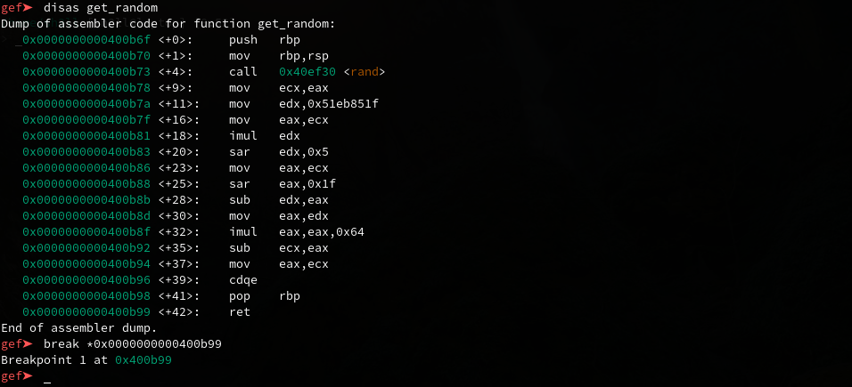
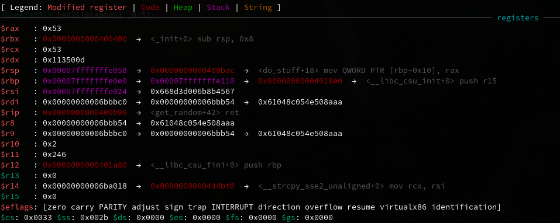

# Guessing Game 1
__Category__: Binary Exploitation   
__Solves__: 151   

> I made a simple game to show off my programming skills.  
> See if you can beat it!
> 
> Attachements: [vuln](./vuln), [vuln.c](./vuln.c), [Makefile](./Makefile)

### Challenge Overview
As the title states the binary implemented a guessing game where the program generated a random number and the user had to guess it.   
If the user guesses it correctly the `win()` function gets executed
and the user has to enter his/her name.

### The Vulnerabilities
The program uses the `rand()` function to generate a random
number. This function uses a [PRNG](https://en.wikipedia.org/wiki/Pseudorandom_number_generator)-algorithm that is implemented by
the glibc and has to be seeded with an initial value.  
The seed can be supplied by calling `srand()` but the program never
calls `srand()`.
As the [manpage](https://linux.die.net/man/3/rand) states:
```
If no seed value is provided, the rand() function is automatically seeded with a value of 1.
```
This means the numbers generated by the program are the same in every run - the first vulnerability.

In the `win()` function a buffer of size 100 gets allocated but in a call to `fgets()` the user can write up to 360 bytes into that buffer - resulting in a buffer-overflow.

### Exploiting the not so random numbers
In order to find out what the return value of `get_random()` is we can analyze it dynamically by running it in a debugger and setting a breakpoint
on the return-statement of `get_random()`.

The return-value of a function goes into the register `rax`. When hitting our breakpoint the registers are as follows:

`rax` has the value 0x53, which is 83 in hexadecimal.
In the source code we can see that the return value of `get_random()` gets incremented. So we have to supply `84` to the program.    

### Exploiting the buffer overflow
In the `win()`-function we can write past the allocated buffer and overwrite the return address of the function.
In order to exploit the buffer overflow successfully we have to use a technique called [Return-Oriented-Programming](https://en.wikipedia.org/wiki/Return-oriented_programming) or ROP for short.   
ROP is a bit like ret2libc in the sense that we overwrite the return address on the stack with an address that points into the binary and not to the stack but with the big difference that we place _multiple_ such addresses on the stack - all one after another. This means that we don't execute only one function but multiple different functions.
Think of it as a chain of ret2libc's.    
But often times we do not even jump to functions as a whole but to addresses that point right into the middle of some functions. These addresses we place on the stack are called ROP-gadgets and multiple ROP-gadgets make a ROP-chain.    
Why do we do all that?   
Because this is a 64-bit binary and the arguments for functions don't go on the stack anymore like with 32-bit binaries. The arguments to a function now go into registers (namely `rdi`, `rsi`, `rdx` and so on).
That means in order to execute `system("/bin/sh")` we have to get the address of `"/bin/sh"` into `rdi` first and than return to `system`. This cannot be done by overwriting a _single_ return-address anymore.    

The binary does not even have `system()` or `execve()` or something that would give us immediate code execution. My solution was to call 
`mprotect()` to make the .text-segment writable, write some shellcode into it with `read()` and execute the shellcode.

`mprotect()` and `read()` both take 3 arguments. That means we need gagdets
to fill `rdi`, `rsi` and `rdx`.    
Luckily the function `init_cacheinfo()` contains the instructions
```
0x0000000000400696:  pop rdi
0x0000000000400697:  ret
```
at the end and `__lll_unlock_wake_private()` ends with 
```
0x000000000044cc49:  pop rdx
0x000000000044cc4a:  pop rsi
0x000000000044cc4b:  ret
```
If we now put a chain of return-addresses on the stack like that:   

| Gadgets            |
|--------------------|
| mprotect()         |
| _value for rsi_    |
| _value for rdx_    |
| 0x000000000044cc49 |
| _value for rdi_    |
| 0x0000000000400696 |

we can call `mprotect()` with arbitrary parameters.   
We can do this analogously with `read()`.

The concrete exploit looks like this:
1. `mprotect(0x0000000000400000, 0xb7000, 7)`
2. `read(0, 0x0000000000400000, 4096)`
3. `0x0000000000400000 (shellcode)`

For a concrete implementation see [exploit.py](./exploit.py).

### Flag
picoCTF{r0p_y0u_l1k3_4_hurr1c4n3_44d502016ea374b8}
