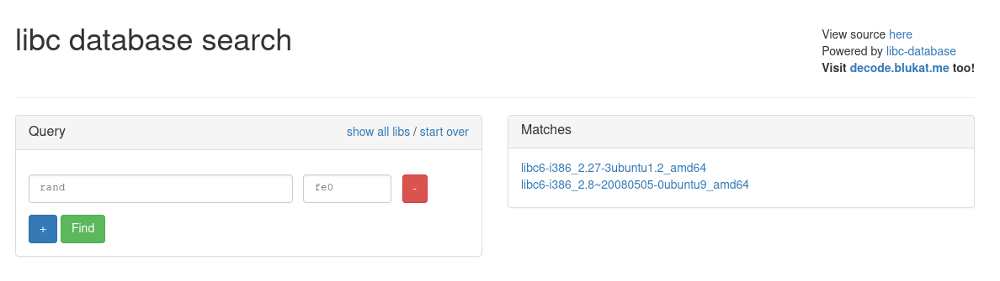

# Guessing Game 2
__Category__: Binary Exploitation   
__Solves__: 89   

> It's the Return of your favorite game!
>
> Attachements: [vuln](./vuln), [vuln.c](./vuln.c), [Makefile](./Makefile)

### Challenge Overview
As with the first challenge we have to enter a number and if the number matches a random number generated by the program we get to the `win()` function.

### The Vulnerabilities
#### get_random()
As with the first challenge the random number of the program is not really random. In fact the `rand()`-function actually never gets called:
```c
long get_random() {
	return rand;
}
```
Instead the address of the function `rand()` gets returned (a [function pointer](https://stackoverflow.com/questions/840501/how-do-function-pointers-in-c-work) casted to a long).
After that the address of `rand()` is taken modulo 4096.   
The number 4096 is very special in this case because it is also the size of a [memory page](https://en.wikipedia.org/wiki/Page_(computer_memory)) in Linux.  

Brief digression:  Memory pages   
The `rand()`-function is part of the libc, which is a shared library used by nearly every program. On the challenge server [ASLR](https://en.wikipedia.org/wiki/Address_space_layout_randomization) is enabled which means that the location of the stack and shared libraries are randomized. But the addresses of those areas are not completely random, they are so called _page-aligned_. That means that the starting-address of the stack and shared libraries must be a multiple of 4096.   
You can also see this in the `/proc/<pid>/maps`-file. Here are the addresses for an example run of vuln:
```
[...]
f7d09000-f7d26000 r--p 00000000 fe:01 2378657        /usr/lib32/libc-2.32.so
[...]
ffbed000-ffc0e000 rw-p 00000000 00:00 0               [stack]
```
As you can see the last three [nibbles](https://en.wikipedia.org/wiki/Nibble) of the start-addresses (1st column) are always `000`.   
This is because `0xf7d09000` is a multiple of 4096 (0x1000):
```py
>>> 0xf7d09000 / 4096
1015049.0
```
So the libc is loaded at the 1015049th memory page.   
With ASLR enabled this number changes of course with every run.

Note that the content of the libc that gets loaded at these addresses is always the same, only the base address changes. This also means that
if the function `rand()` is at position X in the libc the `rand()`-function in the process would be now at base-address + X or 
`0xf7d09000 + X`.   
If we do modulo 4096 we now get the following:
```
  (0xf7d09000 + X) % 4096
= ((0xf7d09000 % 4096) + (X % 4096)) % 4096     // Distributivity
= (0x000 + X) % 4096                            // X < 4096
= X                                             // also X < 4096
```

So if we know X (this is just a matter of finding the right version of the libc) we know the return value of `get_random()`, which will always be the same.

#### win()
In `win()` we have a call to `gets()` which allows for unlimited writing to the stack resulting in a buffer-overflow and we also
have a [format-string vulnerability](https://en.wikipedia.org/wiki/Uncontrolled_format_string) because a user-supplied input gets passed as
the first parameter to `printf()`.

### Exploiting get_random()
As stated above we have to find the position/offset of `rand()` because this will always be the return-value of `get_random()`. The problem is that there are _a lot_ of
different libc versions out there and we don't have insight which libc
is used on the challenge server. So the only solution left is bruteforcing. We just try numbers from 0 - 4096 and see which works. BUT there is a catch: When libraries get loaded into a 32-bit address space their addresses will always start with `0xf7`. The problem with that is that the most-significant bit is set, which means that the address of `rand()` will appear as some negative integer causing the modulo operation to also return a negative integer.
So we actually have to try out -1 to -4096 when bruteforcing and it turns out -31 does the job. -31 means that the offset is 0xfe0.   
See [bf.py](./bf.py) for implementation details.

### Exploiting win()
So we successfully got to the `win()`-function. In contrast to [Guessing Game 1](../Guessing%20Game%201) we are in 32-bit land now
and we can simply do ret2libc but the address of libc is randomized.
We first have to find out where the libc is in memory, then we can overwrite the return-address with `system()`.   
For the first problem the format-string vulnerability comes in handy. This allows us to leak arbitrary values on the stack, such as the return address of `main()`, which will point somewhere into `__libc_start_main()`. But how do we come from `__libc_start_main()` to `system()`?
We can find out the exact version of the libc in use by entering offsets
of certain functions into so called _libc-databases_.
Those databases contain the positions of every function for every version of the libc. If we find out one position of one function we 
can use that to find the whole libc.

The first match is the correct libc. 

Now that we got the correct libc we know all positions of all functions. We substract our leak of `__libc_start_main()` by the position of `__libc_start_main()` in the libc and we get the base-address (with `000` at the end) of the libc and from that we can calculate the address of the `system()` function by adding the position of `system()` to the base-address of the libc.
Fortunately for us every libc comes with a `"/bin/sh"`-string so we can easily calculate its address like above and we have everything ready for
our ret2libc-exploit.    
For implementation details see [exploit.py](./exploit.py).

### Flag
picoCTF{p0p_r0p_4nd_dr0p_1t_ df43c4f079f1f1e}
